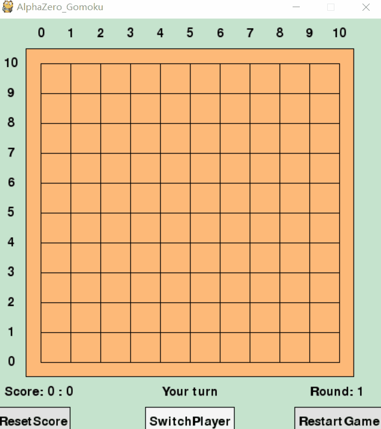
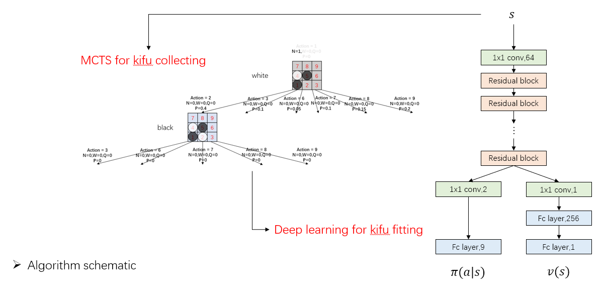
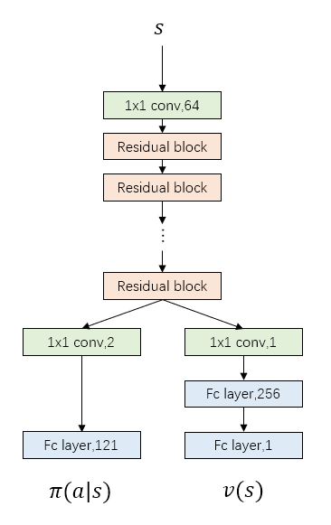

# AlphaZero-Gomoku-MPI



## Updating
* **2019.03.05 -- upload a 15x15 board [model](https://github.com/initial-h/AlphaZero_Gomoku_MPI/tree/master/model_15_15_5)**

## Overview
This repo is based on [junxiaosong/AlphaZero_Gomoku](https://github.com/junxiaosong/AlphaZero_Gomoku), sincerely grateful for it.

I do these things:
* **Implement asynchronous self-play training pipeline in parallel like AlphaGo Zero's way**
* **Write a root parallel mcts (vote a move using ensemble way)**
* **Use ResNet structure to train the model and set a transfer learning API to train a larger board model based on small board's model (like pre-training way in order to save time)**
 
Strength
* Current model is on 11x11 board, and playout 400 times when test
* Play with [this model](https://github.com/yzhq97/AlphaGomokuZero), can always win regardless of black or white
* Play with [gomocup's AI](http://gomocup.org/download-gomoku-ai/), can rank around 20th-30th for some rough tests
* When I play white, I can't win AI. When I play black, end up with tie/lose for most of my time

References

* [Mastering the game of Go without human knowledge](https://www.nature.com/articles/nature24270.pdf)
* [A general reinforcement learning algorithm that masters chess, shogi, and Go through self-play](http://science.sciencemag.org/content/362/6419/1140)
* [Parallel Monte-Carlo Tree Search](http://www.researchgate.net/profile/H_Herik/publication/220962546_Parallel_Monte-Carlo_Tree_Search/links/02bfe511b4a1e8f846000000)

Blog
* [deepmind blog](https://deepmind.com/blog/alphazero-shedding-new-light-grand-games-chess-shogi-and-go/)
* [mpi4py blog -- author: 自可乐](https://www.jianshu.com/p/505ab84fe725)

## Installation Dependencies
* Python3
* tensorflow>=1.8.0
* tensorlayer>=1.8.5
* mpi4py (parallel train and play)
* pygame (GUI)

## How to Install

> tensorflow/tensorlayer/pygame install : 
```
pip install tensorflow
pip install tensorlayer
pip install pygame
```

> mpi4py install [click here](https://www.jianshu.com/p/ba6f7c9415a0)
>
> mpi4py on windows [click here](https://blog.csdn.net/mengmengz07/article/details/70163140)

## How to Run
* Play with AI
```
python human_play.py
```
* Play with parallel AI (-np : set number of processings, take care of OOM !)
```
mpiexec -np 3 python -u human_play_mpi.py 
```
* Train from scratch
```
python train.py
```
* Train in parallel
```
mpiexec -np 43 python -u train_mpi.py
```

## Algorithm
It's almost no difference between AlphaGo Zero except APV-MCTS.
A PPT can be found in dir [demo/slides](https://github.com/initial-h/AlphaZero_Gomoku_MPI/tree/master/demo/slides)



## Details
Most settings are the same with AlphaGo Zero, details as follow :
* Network Structure
  * Current model uses 19 residual blocks, more blocks means more accurate prediction but also slower speed
  * The number of filters in convolutional layer shows in the follow picture 

    

* Feature Planes 
  * In AlphaGo Zero paper, there are 19 feature planes: 8 for current player's stones, 8 for opponent's stones, and the final feature plane represents the colour to play
  * Here I only use 4 for each player, it can be easily changed in ```game_board.py```
* Dirichlet Noise
  * I add dirichlet noises in each node, it's different from paper that only add noises in root node. I guess AlphaGo Zero discard the whole tree after each move and rebuild a new tree, while here I keep the nodes under the chosen action, it's a little different
  * Weights between prior probabilities and noises are not changed here (0.75/0.25), though I think maybe 0.8/0.2 or even 0.9/0.1 is better because noises are added in every node
* Parameters in Detail
  * I try to maintain the original parameters in AlphaGo Zero paper, so as to testify it's generalization. Besides, I also  take training time and computer configuration into consideration.
  
    |Parameters Setting|      Gomoku  |AlphaGo Zero     |
    |:---------------: |:------------:|:---------------:|
    |      MPI num     | 43           |-                |
    |          c_puct  | 5            |5                |
    |      n_playout   | 400          |1600             |
    |     blocks       | 19           |19/39            |
    |     buffer size  | 500,000(data)|500,000(games)   |
    |      batch_size  | 512          |2048             |
    |           lr     | 0.001        |annealed         |
    | optimizer        | Adam         |SGD with momentum|
    | dirichlet noise  | 0.3          |0.03             |
    | weight of noise  | 0.25         | 0.25            |
    |     first n move | 12           |30               |
    
* Training detials
  * I train the model for about 100,000 games and takes 800 hours or so
  * Computer configuration : 2 CPU and 2 1080ti GPU
  * We can easily find the computation gap with DeepMind and rich people can do some future work

## Some Tips
* Network
  * **ZeroPadding with Input** : Sometimes when play with AI, it's unaware of the risk at the edge of board even though I'm three/four in a row. ZeroPadding data input can mitigate the problem
  * Put the network on GPU : If the network is shallow, it's not matter CPU/GPU to use, otherwise it's faster to use GPU when self-play
* Dirichlet Noise
  * **Add Noise in Node** : In [junxiaosong/AlphaZero_Gomoku](https://github.com/junxiaosong/AlphaZero_Gomoku), noises are added outside the tree, seemingly like DQN's ε-greedy way. It's ok when I test on 6x6 and 8x8 board, but when on 11x11 some problems occur. After a long time training on 11x11, black player will always play the first stone in the middle place with policy probability equal to 1. It's very rational for black to play here, however, the white player will never see other kifu that play in the other place at first stone. So, when I play black with AI and place somewhere not the middle place, AI will get very stupid because it has never seen this way at all. Add noise in node can mitigate the problem
  * Smaller Weight with Noise : As I said before, I think maybe 0.8/0.2 or even 0.9/0.1 is a better choice between prior probabilities and noises' weights, because noises are added in every node
* Randomness
  * **Dihedral Reflection or Rotation** : When use the network to output probabilities/value, it's better to do as paper said: "The leaf node s_L is added to a queue for neural network evaluation, (d_i(p),v)=f_θ(d_i(s_L)), where d_i is a dihedral reflection or rotation selected uniformly at random from i in [1..8]".
  * Add Randomness when Test : I add the dihedral reflection or rotation also when play with it, so as to avoid to play the same game all the time
* Tradeoffs
  * Network Depth : If the network is too shallow, loss will increase. If too deep, it's slow when train and test. (My network is still a little slow when play with it, I think maybe 9 blocks is all right)
  * Buffer Size : If the size is small, it's easy to fit by network but can't guarantee it's performance for only learning from these few data. If it's too large, much longer time and deeper network structure should be taken
  * Playout Number : If small, it's quick to finish a self-play game but can't guarantee kifu's quality. On the contrary with more playout times, better kifu will get but also take longer time

## Future Work
* Continue to train (a larger board) and increase the playout number
* Try some other parameters for better performance
* Alter network structure
* Alter feature planes
* Implement APV-MCTS
* Train on standard/renju rule

